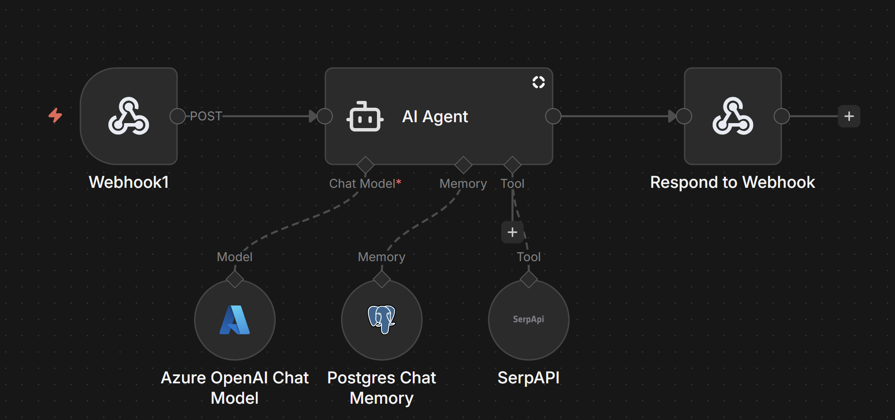

# Next_JS_Chat_N8N

A custom frontend (built using Next JS) that allows users to interact with n8n AI Agent via webhook. 

## Key features:
- Uses Supabase for authentication
- User can create new chats as well as view existing chats
- Existing user chats are stored in a postgres database

Note that sign up form is disabled, only authorized users are allowed to log in

## Running Locally

```bash
npm run dev
```

Open [http://localhost:3000](http://localhost:3000) in your browser.

## N8N Workflow


## N8N Components
### Webhook1 (Trigger)
This is the entry point of the n8n workflow. It creates a URL that listens for incoming HTTP POST requests.

Security: This is secured with JWT (JSON Web Token), meaning n8n will validate a signed token in the header before allowing the workflow to proceed, ensuring only authorized users can trigger the AI.

### AI Agent
The AI Agent receives a user request, and decides which tools to use to provide the best response. 

It also saves all chat messages into a Postgres database table.  

We are using Azure OpenAI as the LLM, other providers such as Groq are also supported. 

### SerpAPI
An external tool that allows the AI to perform Google Searches. If the AI doesn't know an answer, it uses this to look up real-time information.

## JWT Webhook Details
To set the JWT Authentication for the N8N webhook, we need to specify the following:
- A Passphrase
- An Algorithm (HS256)

In our NextJS app, we install the JWT library
```
npm install jsonwebtoken
```

We specify the passphrase in the .env.local file
```
N8N_JWT_SECRET=PASSPHRASE
```

In our NextJS backend api route `app/api/chat/route.js` 
- we import the JWT library
- create a signed token from our passphrase
- pass the token in the authorization header of the post request to the webhook URL
```JS
import jwt from 'jsonwebtoken';
const N8N_JWT_SECRET = process.env.N8N_JWT_SECRET; // must match n8n JWT credential

// Generate JWT token
const token = jwt.sign(
    { sid: currentSessionId },
    N8N_JWT_SECRET,
    { algorithm: 'HS256', expiresIn: '5m' }
);

// Pass the token in the authorization header of the post request
headers: { 
    'Content-Type': 'application/json',
    Authorization: `Bearer ${token}`,
},
```